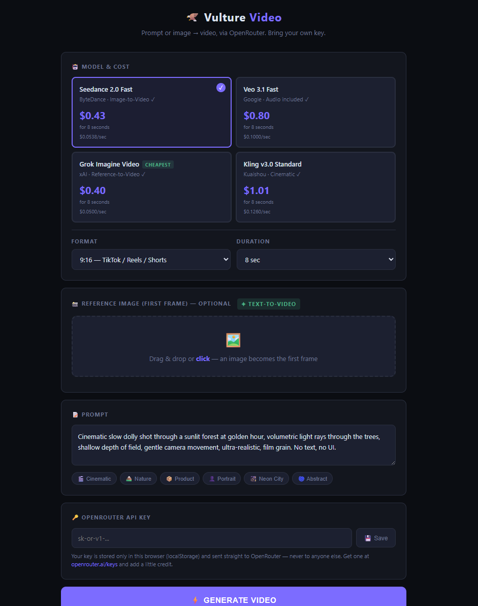

<h1 align="center">Vulture Video</h1>

<b>A dead-simple AI video generator — one self-contained HTML file.</b> 
Type a prompt (or drop an image as the first frame), pick a model, hit generate. 
Powered by <a href="https://openrouter.ai">OpenRouter</a>'s video API — you bring your own key.

No install, no build, no server, no account on our side. Just open <code>index.html</code>.

---

## What it does

- **Text-to-Video** — describe a scene, get a clip.
- **Image-to-Video** — drop an image and use it as the first frame.
- **Model picker** with live cost estimates (Seedance, Veo, Grok, Kling — whatever OpenRouter offers).
- Formats for **TikTok / Reels (9:16)**, **YouTube (16:9)** and **Instagram (1:1)**, 5–15 seconds.
- Live progress log, in-page preview, one-click **MP4 download**.

## Get started

1. **Download** this repo (green **Code** button → *Download ZIP*) and unzip it — or just grab `index.html`.
2. Get an **OpenRouter API key** at [openrouter.ai/keys](https://openrouter.ai/keys) and add a little credit.
3. **Double-click `index.html`** — it opens in your browser.
4. Paste your key, write a prompt, and click **Generate Video**.

That's it. It's one file.

## Your key & privacy

- Your API key is stored **only in your browser** (`localStorage`) and is sent **straight to OpenRouter** — never to us or anyone else. There is no backend.
- You pay **OpenRouter directly** for whatever you generate. The in-app prices are estimates and can change — check your OpenRouter dashboard.

## Notes

- This is the **online** sibling of [Vulture AI](https://github.com/ronnyplayplace-bot/vulture-ai) (the fully-offline local AI studio). Vulture Video needs the internet and an OpenRouter key, so it is *not* offline — it's the "no GPU, just make a video now" option.
- Model IDs and pricing live at the top of the `<script>` in `index.html` — edit the `MODELS` array to add or update models.

## License

MIT — use it, change it, ship it. A ⭐ helps.

Built by **Overlkd Studio**. Open to ideas and collaboration — open an issue. 🦅
